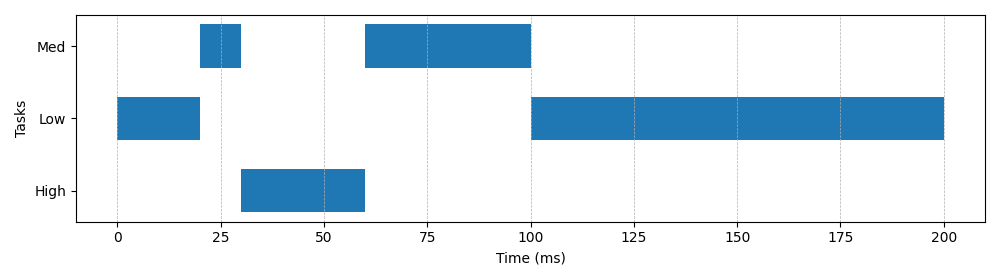

# RTOS Scheduler Simulation

This project simulates a simple Real-Time Operating System (RTOS) scheduler in C++.  
It demonstrates basic scheduling concepts and provides performance analysis through log parsing and visualization.

---

## 📂 Project Structure

```
rtos-scheduler/
│
├── main.cpp             # RTOS scheduler simulation code
├── logs/
│   ├── sample.log       # Sample run output
│   └── sample.csv       # Log data in CSV format
├── metrics.txt          # CPU utilization, context switches, task runtimes
├── plots/
│   └── gantt.png        # Visual Gantt chart of task scheduling
└── analyze_logs.py      # Python script to analyze logs and create metrics/plots
```

---

## 🛠️ How to Compile and Run the Simulation

1. **Compile the C++ code**  
   ```bash
   g++ -std=c++17 main.cpp -O2 -o scheduler
   ```

2. **Run the scheduler**  
   ```bash
   ./scheduler > logs/sample.log
   ```

---

## 📊 Log Analysis and Visualization

1. **Run the Python analysis script**  
   ```bash
   python analyze_logs.py
   ```

2. **Outputs generated:**
   - `logs/sample.csv` → log data in CSV format  
   - `metrics.txt` → CPU utilization, context switches, per-task runtimes  
   - `plots/gantt.png` → Gantt chart visualization

---

## 📈 Metrics Output (from this run — 2025-08-11)

```
Total simulated time (ms): 200
CPU busy ms: 200
CPU utilization (%): 100.00
Context switches: 4
Per-task runtimes (ms and %):
  High: 30 ms (15.00%)
  Low: 120 ms (60.00%)
  Med: 50 ms (25.00%)
```

---

## 📷 Gantt Chart Visualization

Here’s an example of the generated task execution timeline:



---

## 🎯 Learning Outcomes

- Understanding of RTOS scheduling principles  
- Generating and parsing logs  
- Visualizing task execution timelines  
- Measuring CPU utilization and context switching overhead

---
